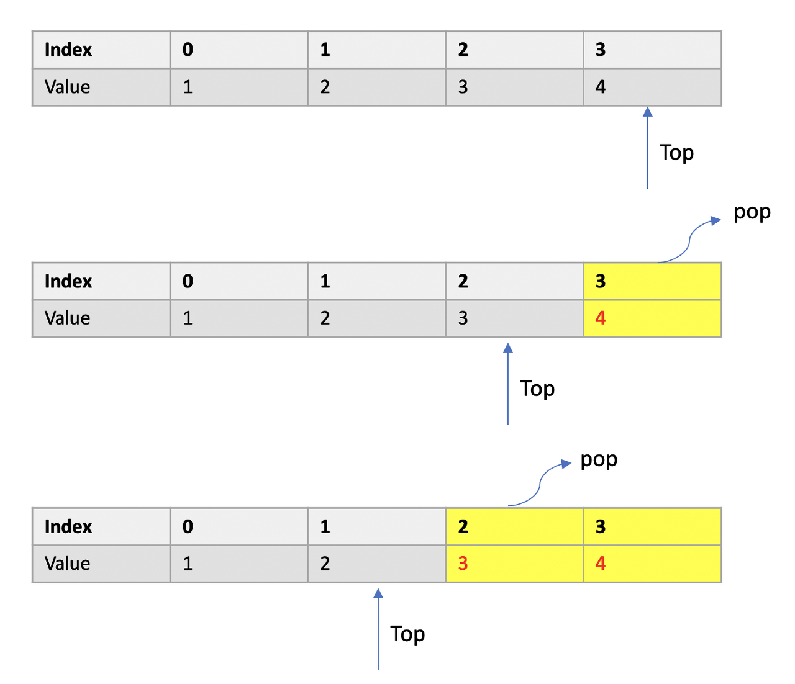

# 아이템 7. 다 쓴 객체 참조를 해제하라

* 자바는 가비지 컬렉터를 갖춘 언어로, C, C++처럼 직접 메모리를 관리하지지 않아도 되며, 다 쓴 객체를 자동으로 회수해간다.
* 단, 가비지 컬렉터가 객체를 자동으로 회수하지 못하는 상황이 존재한다.

  
## 객체 참조 해지를 안 하면 어떻게 될까? 
```java
public class Stack {
    private Object[] elements;
    private int size = 0;
    private static final int DEFAULT_INITIAL_CAPACITY = 16;

    public Stack() {
        elements = new Object[DEFAULT_INITIAL_CAPACITY];
    }

    public void push(Object e) {
        ensureCapacity();
        elements[size++] = e;
    }

    public Object pop() {
        if (size == 0) {
            throw new EmptyStackException();
        }

        return elements[--size];
    }

    public void ensureCapacity() {
        if (elements.length == size) {
            elements = Arrays.copyOf(elements, 2 * size + 1);
        }
    }
}
```

> 위 예제 코드는 기능적으로 문제가 발생하지 않는다.  
> 단, 위 코드에선 스택에서 꺼내진 객체들을 프로그램에서 더 이상 사용하지 않더라도 가비지 컬렉터가 회수하지 않는다.  
> 메모리 누수가 발생하여 프로그램이 점차 느려지거나 메모리 사용량이 계속 늘어나 OutOfMemoryError를 일으켜 프로그램이 예기치 않게 종료될 수 있다.


## 메모리 누수는 어디서 발생할까?


> 스택이 객체들의 다 쓴 참조(obsolete reference)를 여전히 가지고 있기 떄문에 가비지 컬렉터에 의해 회수되지 않는다.  
  다 쓴 참조 객체 대상은 elements 배열의 활성 영역 박의 참조들이 해당하다.  
  활성 영역은 인덱스가 size보다 작은 원소들로 구성된다.  

## 개선은 어떻게?
* 해법은 간단하다. 
* 해당 참조를 다 썻을 때 null 처리하면 된다.

```java
public Object pop() {
    if (size == 0) {
        throw new EmptyStackException();
    }

    Object result = elements[--size];
    elements[size] = null; // 다 쓴 참조 해제, 해당 참조를 다 썻을 때 null 처리

    return result;
} 
```

> 다 쓴 참조를 null 처리할 경우 다른 이점도 따라온다.  
> null 처리한 참조를 사용할 경우 NullPointException를 발생시켜 기능적으로 잘못된 처리를 발견할 수 있다.

## 다 쓴 객체를 무조건 null 처리 할 필요 없다.
* 코드를 필요 이상으로 지저분하게 만들뿐이다. 
* 다 쓴 참조를 해제하는 가장 좋은 방법은 그 참조를 담은 변수를 유효 범위 밖으로 밀어내는 것이다.

```java
public Object print() {
        Object obj = new Object();
        System.out.println(obj);
        obj = null; // 의미 없음
}
```

## 그렇다면, 언제 null 처리를 해야될까?
* 자기 메모리를 직접 관리하는 경우 처리해야된다.
* 위 스택 예제처럼 elements라는 배열을 관리하는 경우 가비지 컬렉터가 어떤 객체가 필요없는 객체인지 알 수 없다.
* 객체가 더 이상 사용되지 않다는 건 프로그래머만 알기 때문에, 비활성 영역이 되는 순간 null 처리하여, 가비지 컬렉터에게 사용되지 않음을 알려야한다.

## 그 밖의 메모리 누수 케이스
* 캐시 역시 메모리 누수를 일으키는 주범이다.
* 캐시를 만들 때 보통 캐시 엔트리의 유효 기간을 정확히 정의하기 어렵기 때문에 시간이 지날수록 엔트리의 가치를 떨어뜨리는 방식을 흔히 사용한다.
* 쓰지 않는 엔트리를 백그라운드 스레드를 활용하거나, 캐시에 새 엔트리를 추가할 때 부수 작업으로 수행하는 방법으로 청소해준다.
* 메모리 누수의 다른 주범으로는 콜백(or 리스너)이 있다. 클라이언트가 콜백을 등록만 하고 명확히 해지하지 않는다면, 뭔가 조치를 취하지 않는 한 콜백은 계속 쌓인다.  