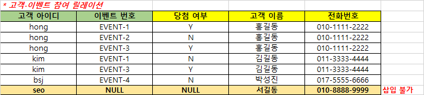

# 정규화

## 정규화란?
```
데이터의 중복을 최소화하기 위해 데이터를 구조화하는 작업을 정규화라고 한다.
종속 관계를 분석하여 여러개의 릴레이션으로 분해하는 과정
```

## 정규화 목적
1. 데이터 조작 시 이상 현상(삽입/갱신/삭제) 방지
2. 저장 공간 최소화
3. 데이터 안정성, 무결성 유지
4. 데이터 구조 확장 시 이펙트 최소화
5. 다양한 관점에서의 검색 알고리즘 가능


## 정규화 단점
1. 릴레이션 간의 JOIN 연산 증가


## 이상 현상


### 삽입 이상
* 새 데이터를 삽입하기 위해 불필요한 데이터도 함께 삽입해야 하는 문제를 삽입 이상이라고 한다.
seo 라는 신규 고객이 회원 가입을 하게 되어, 위 릴레이션에 고객에 대한 데이터를 삽입해야 한다고 가정해보면, 
이 고객이 참여한 이벤트가 아직 존재하지 않기 때문에 삽입할 수 없다.


  삽입하기 위해서는 임시로 사용할 불필요한 데이터를 삽입해야 하므로 삽입 이상이 발생하게 된다.  
  

### 갱신 이상
* 릴레이션의 중복된 투플들 중 일부만 수정하여 데이터가 불일치하게 되는 모순이 발생하는 것을 갱신 이상이라고 한다.  

  고객 아이디가 kim 인 고객의 전화번호가 011-3333-4444 에서 010-3333-4444로 변경된다면, 이벤트 참여 릴레이션에서 kim인 고객에 대한 투플 2개의 전화번호 속성 값이 모두 수정되어야 한다.  
그렇지 않고, 1개만 수정된다면 같은 고객이 서로 다른 전화번호를 가지게 되는 모순이 생겨 갱신 이상이 발생하게 된다.  


### 삭제 이상
* 투플을 삭제하면 의도하지 않은 다른 정보까지 함께 삭제하여, 데이터가 손실되는 연쇄적으로 삭제되는 현상을 삭제 이상이라고 한다.

  고객 아이디가 bsj인 고객이 이벤트 참여를 취소하여, 이벤트참여 릴레이션에서 관련된 투플을 삭제해야 한다면, 아래 빨간 영역 하나의 투플만 삭제하면 된다.   


그런데 이 투플은 bsj 고객이 참여하고 있는 이벤트의 정보만 가지고 있는 것이 아니라, **해당 고객에 대한 정보(아이디, 이름, 전화번호)** 도 유일하게 가지고 있다.  
빨간 영역의 투플이 삭제되면, 이벤트 참여에 대한 데이터 뿐 아니라 고객에 대한 정보까지 원치 않게 삭제되는 현상이 발생하게 된다.  

### 정규화의 필요성 
**위 이상 현상이 발생하는 이유는, 관련이 없는 속성들을 하나의 릴레이션에 모아두고 있기 때문이다.**  


## 정규화 과정
