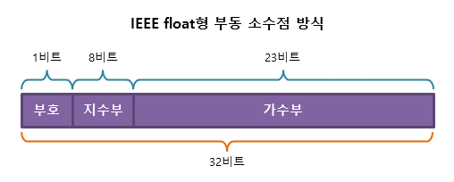

# Special Item 02. 부동소수점 연산

## 부동소수점이란 

실수를 가수부 + 지수부로 나누어 표현합니다.
- 부호 : 양수는 0, 음수는 1
- 가수 : 실수의 실제값을 표현
- 지수 : 크기를 표현, 가수의 어디쯤에 소수점이 있는지를 나타냄.

즉, 지수의 값에 따라 소수점이 움직이기 때문에 이 방식으로 실수를 표현 하는 방법을 부동소수점이라고 합니다.

### 부동 소수점 방식


기수부 에는 실제 실수 데이터 비트들이 들어가고, 지수부에는 소수점의 위치를 가리키는 제곱승 이 들어간다고 보면 된다.


## 부동 소수점 계산 방법
현재 사용되고 있는 부동 소수점 방식은 대부분 IEEE 754 표준을 따르고 있다. 그리고 자바도 이 표준을 따른다. <br />
IEEE 754 표준의 부동 소수점 수학적 수식은 다음과 같이 된다.



`-118.625 실수를 부동 소수점으로 변환해보자`
1. 음수이기에 최상위 비트를 1로 설정해준다.
2. 절대값 118.625 를 이진법으로 변환해준다.
3. 소수점을 이동시켜 정수부가 한자리가 되도록 변환해준다. (그러면 지수 6이 만들어진다)
4. 가수부 비트에 실수값 그대로를 넣는다 (점 무시)
5. 지수에 바이어스 값(127)을 더하고 지수부 비트에 넣는다.

 ※ 32bit IEEE 754 형식에는 bias라는 고정값(127)이 존재한다.
이 bias라는 값을 왜 쓰냐면, 지수가 음수가 될 수도 있는 케이스가 있기 때문이다. (2^10 or 2^-10)

## 프로그래밍에서의 소수 계산 오차
```java
1) 예제
System.out.println(10.2 + 0.1); // 10.299999999999999
System.out.println(0.2 + 0.1); // 0.30000000000000004
System.out.println(10.2 - 9.1); //1.0999999999999996

double sum = 0;
for(int cnt = 0 ; cnt < 100 ; cnt++) {
sum += 0.1;
}
System.out.println(sum); //9.99999999999998

```

## 소수 계산 오차가 생기는 이유

0.1 와 같이 0.0001100110011...(2) 로 무한 반복되는 이진수 실수는 아무리 큰 수를 저장하는 부동 소수점 방식이라 해도 무한대를 저장할수 없으니 결국 메모리 한계까지 소수점을 집어넣고 어느 부분에서 끊어 반올림을 해주어야 한다. <br />

즉, 컴퓨터의 메모리는 한정적이기 때문에 `실수의 소숫점을 표현할 수 있는 수의 제한`이 존재하게 될 수 밖에 없다.

그리고 실수를 표현하는 숫자 제한이 있다는 것은 곧 `부정확한 실수의 계산값을 초래`하게 된다.


## 소수 정확히 계산하는 방법
1. BigDecimal클래스의 메소드를 이용 (BigDeciaml 객체 생성 시 String으로 형 변환하여 생성해야 한다는 것을 주의)
2. 정수형 타입으로 치환
```java
1) 예시
BigDecimal val1 = new BigDecimal("1.1");
BigDecimal val2 = new BigDecimal("0.1");

//더하기
System.out.println(val1.add(val2));	//1.2
//나누기
System.out.println(val1.divide(val2));	//11

double beforeSum = 0;
BigDecimal afterSum = new BigDecimal("0");
for(int cnt = 0 ; cnt < 100 ; cnt++) {
    beforeSum += 0.1;
    afterSum = afterSum.add(new BigDecimal("0.1"));
}
System.out.println("beforeSum : " + beforeSum);	//beforeSum : 9.99999999999998
System.out.println("afterSum : " + afterSum);	//afterSum : 10.0
        
2) 예시
double a = 10.2;
double b =  9.1;

// 각 숫자에 10을 곱해서 소수부를 없애주고 정수로 형변환
long a2 = (int)(a * 10);
long b2 = (int)(b * 10);
double result = (a2 - b2) / 10.0; // 그리고 정수끼리 연산을 해주고, 다시 10.0을 나누기 하여 실수로 변환하여 저장
System.out.println(result); // 0.1
```